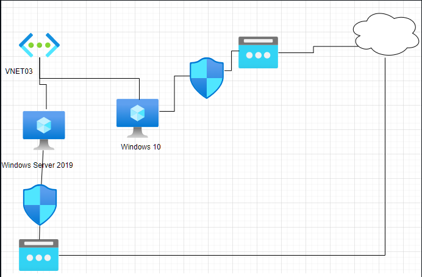
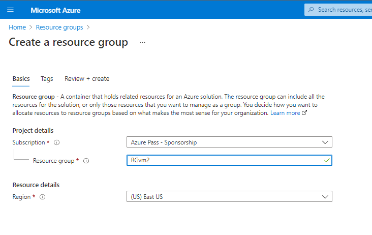
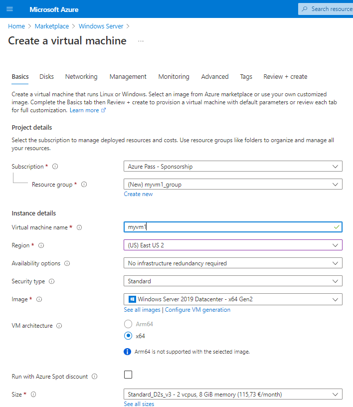
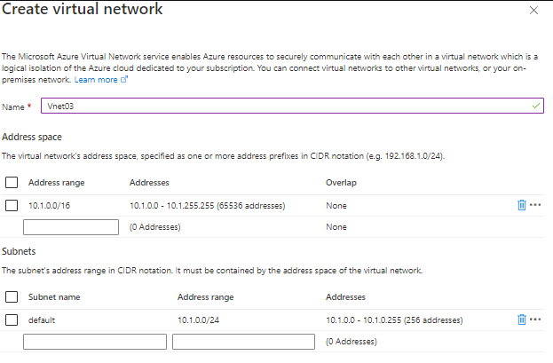
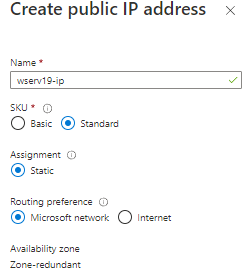
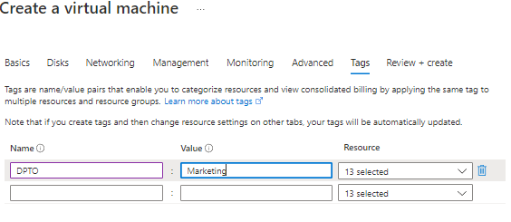
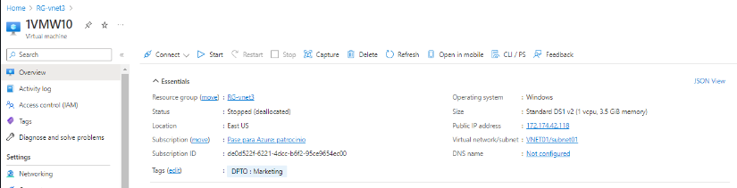
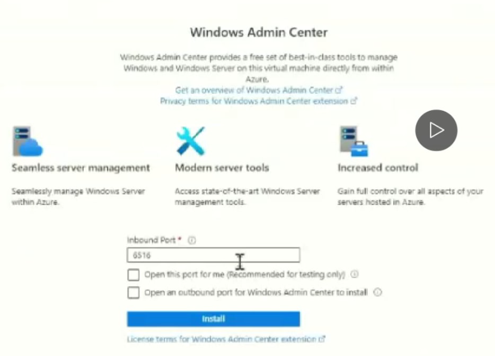
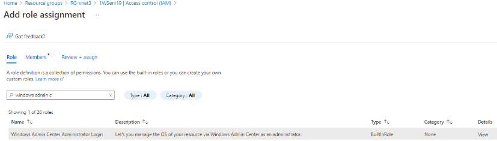

# Redes Virtuales en Azure

Hoy aprenderemos a unir dos maquinas virtuales en Azure a través de una misma red. Este es el diagrama que nos daría la respuesta ante esta necesidad:

## Paso 1

Abrimos Azure y creamos nuestro grupo de recursos:

## Paso 2

A continuación crearemos nuestras máquinas virtuales Windows Server 2019 DataCenter:

*En este caso estableceremos el grupo de recursos que creamos al principio

*Estableceremos en los puertos el http también. 

En el apartado **Disks** seleccionaremos los discos Standard SSD's:

Como hemos comenzado creando primero la maquina ahora deberemos crear la red dentro del menú **Networking** y asociarle los datos correspondientes

Creamos una red nueva y se nos muestra el siguiente menú:

Nombramos a la subred subnet01 y modificamos el rango de IPs 10.0.0.0/20, la subred tendrá el siguiente rango 10.0.0.0/24

Asignación nombre y parámetros ip publica:

**NSG**

Network Security Group

Abrimos puerto HTTP y RDP (80, 3389)

**TAGGING **

Asociaremos los recursos a unas etiquetas para poder identificarlos de manera mas simple, creamos este proyecto para el Dpto de Marketing:

Tras esto damos esto en review + create y se nos mostrara un resumen con los datos con los que hemos diseñado nuestra maquina, creamos y tardara unos minutos en desplegar nuestra maquina virtual.

## Paso 3:

### Creación de la maquina virtual de Windows 10:

Nuevamente dentro del grupo de recursos vamos al marketplace y buscamos maquina virtual

Le asociamos ***el nombre usuario contraseña, red y subred ya creadas, ip publica y tags y el NGS*** igual que el anterior pero sin el puerto 80 abierto ya que no lo necesitamos en el W10

## Paso 4:

### Admin Center en el WServ19

Ingresamos al apartado de Windows Admin Center dentro de la configuración de nuestra maquina y abrimos nuestros puerto 6516 tickando las 2 opciones e instalamos:

También necesitaremos el admin center en nuestra maquina local, a la hora de instalarlo via ejecutable nos salto un error y debimos de instalarlo con este comando

*msiexec -i WindowsAdminCenternºversion.msi productLanguage="1033"*

**CONFIGURACION EXTRA WServer2019**

Añadimos el admin center en la maquina virtual de Azure, lo asociamos en nuestro admin center local con el ***TENANT ID***.

Tras esto se nos conectara con nuestra cuenta de Azure, iniciaremos sesión y se nos pedirá identificar la suscripción grupo de recursos y maquina.

Por ultimo hemos de revisar la pertenencia al rol "Windows Admin Center Administrator Login" Role dentro de Acces control (IAM)

